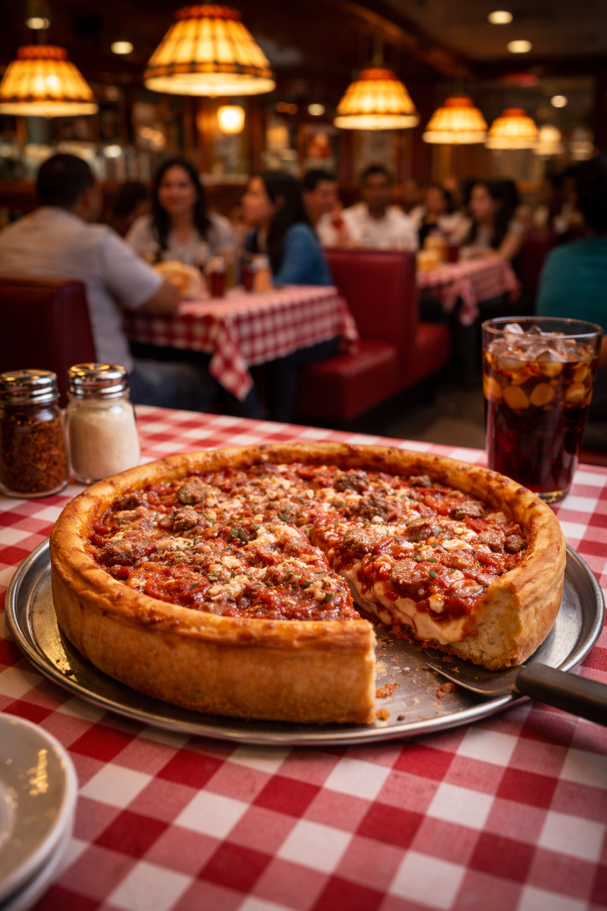

# AI Prompt Extractor (ComfyUI Custom Node)

A ComfyUI custom node that analyzes an input image using the OpenAI Responses API and generates a **single, well-structured positive prompt line in a variety of formats** suitable for direct use in image generation workflows.

Repository: https://github.com/kurtgamer01/ai-prompt-extractor

---

## Features

- Image → prompt extraction
- **Selectable OpenAI models per node** (recommended default: `gpt-5-mini` or 'grok-4-1-fast-non-reasoning)
- Enforces strict section ordering:
  - subject
  - scene
  - style
  - clothing
  - pose and body orientation
  - facial expression and gaze
  - lighting
  - camera and shot framing
- Outputs one comma-separated positive prompt line or full sentences
- No negative prompts
- No explanations, labels, or markdown in output
- Handles multi-person scenes and clothing vs. pose constraints
- Designed for ComfyUI-native workflows (Preview Text, downstream prompt nodes)

---

## Output Format

Prompt output depends on the AI model, instructions passed, and output format.

## Examples
For the following image: 



gpt-5-mini, zimage, sentence chucks

A thick Chicago-style deep-dish pizza sits at the center of the image, roughly whole with one slice slightly separated, topped with chunky tomato sauce, melted cheese, and crumbled sausage; the crust is high and golden-brown with visible crumb texture. A classic diner interior with checkered red-and-white tablecloths, red vinyl booths and warm hanging lamps; other diners are visible in soft focus in the background and a glass of cola and seasoning shakers sit near the pizza. A metal pizza tray and a black-handled serving spatula rest beneath the pizza, and the table is covered in a cotton red-and-white gingham tablecloth. The pizza is centered on the table with one slice partially removed and the cut revealing layers of cheese and sauce; the pie sits level on its tray with the spatula angled outward. No visible facial expressions or gaze are present in the image. Warm, diffuse overhead lighting from pendant lamps creates soft highlights on the cheese and a gentle falloff into the background, producing a cozy, inviting ambiance. Tight medium framing focused on the pizza in the foreground with a shallow depth of field that blurs the diner interior behind it; eye-level angle slightly above the table. Warm, cinematic food photography with an intimate, editorial feel emphasizing texture and atmosphere.

gpt-5-mini, sdxl_prompt_instructions, simplified_juggernaut

deep dish pizza, single slice removed, metal tray, glass of cola, cozy busy diner, red checkered tablecloths, booths, blurred patrons in background, hanging lamps, warm ambient pendant lighting, soft highlights, cozy mood, close-up, low angle, tabletop view, shallow focus, bokeh, realistic food photography, warm tones, appetizing, shallow depth of field

---

## Installation

Clone the repository into your ComfyUI `custom_nodes` directory:

```bash
cd ComfyUI/custom_nodes
git clone https://github.com/kurtgamer01/ai-prompt-extractor.git
```

Install dependencies into your **ComfyUI virtual environment**:

```bash
pip install -r requirements.txt
```

Restart ComfyUI after installation.

---

## Requirements

Declared in `requirements.txt`:

- `openai` (Responses API client)
- `numpy`
- `Pillow`

Torch, CUDA, and ComfyUI core dependencies are intentionally **not** included and are expected to already exist in your ComfyUI environment.

---

## Model Selection

The OpenAI model is selectable per node and passed directly to the Responses API.

---

## Configuration

The node exposes configurable inputs inside ComfyUI, including:

- AI API & model selection
- Maximum output tokens
- Instruction rules file
- JPEG Compression Tuning for transport control (smaller size, less bandwith use, does not meaningly effect input token cost)
- Setting an output to 'False' allows for a custom value to be inserted into the prompt. Value will not be inserted if set to 'True'. 
- Section order at the bottom overrides default section order and allows inserting fields misc1 and misc2

Behavior notes:

- Custom nodes are loaded at ComfyUI startup; a restart is required after code changes.
- The node forces text output and limits internal reasoning to avoid empty responses.
- Errors are handled gracefully and will not crash a ComfyUI graph.

---

## Intended Use Cases

- Reverse-engineering prompts from reference images
- Generating structured prompts from photos or concept art
- Building automated prompt pipelines inside ComfyUI
- Producing consistent prompts for iteration or LoRA workflows

---

## License

Apache-2.0
